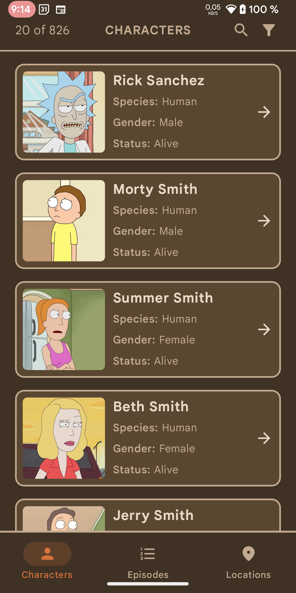
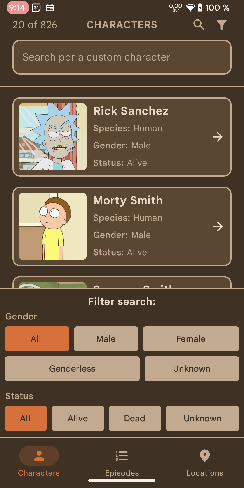
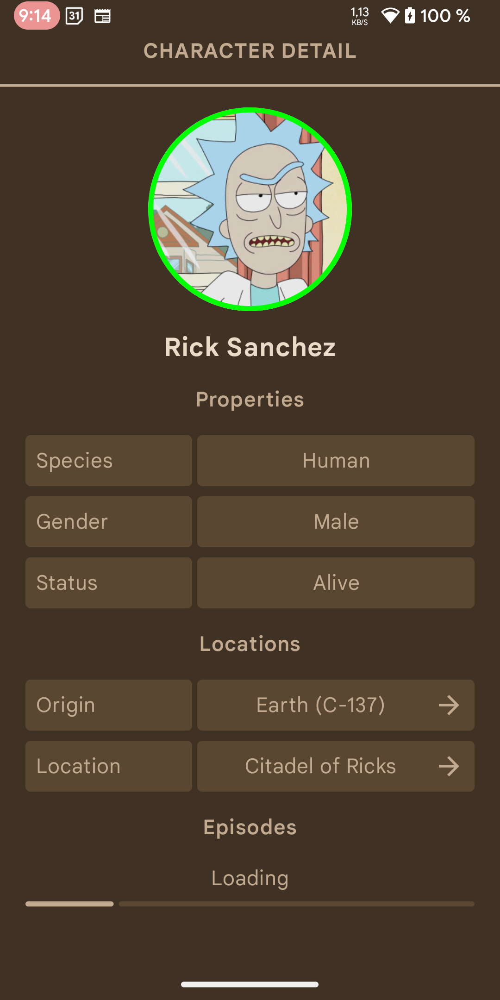
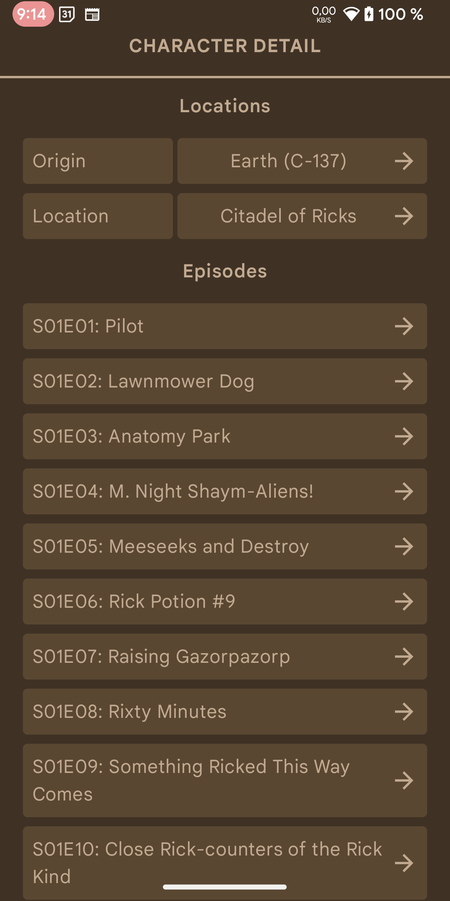
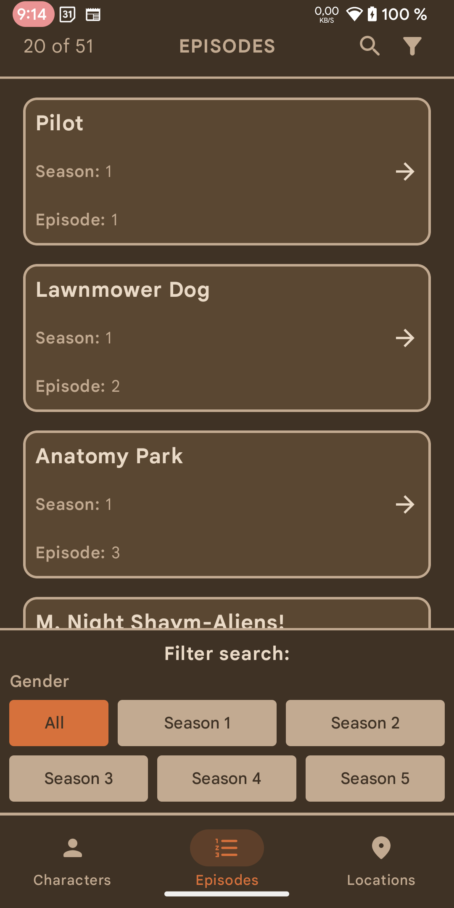
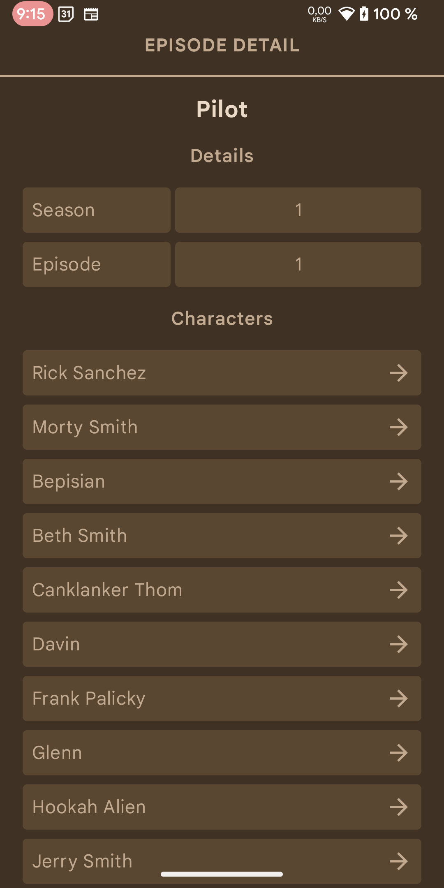
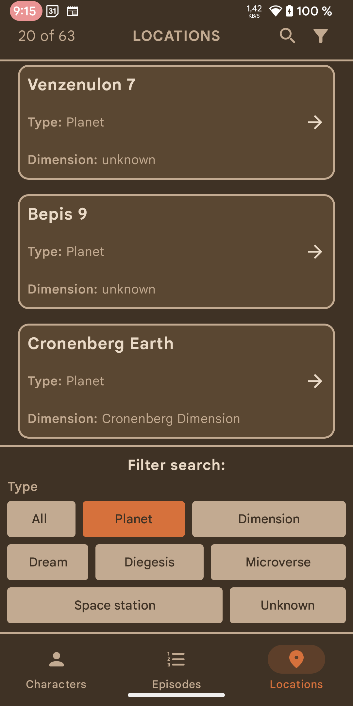
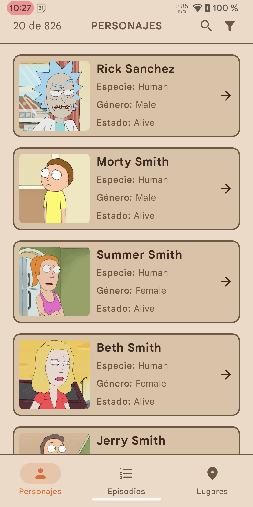

# 📱 Rick and Morty DB

An Android application that explores the **Rick and Morty** universe, offering detailed information about **characters**, **episodes**, and **locations** from the series.

The app fetches real-time data from a public API and is built using the latest Android development tools with a modern, scalable architecture.

---

## ✨ Features

- 🔍 Browse all characters, episodes, and locations from the series.
- 🧠 Detailed views for each entity: characters, episodes, and places.
- 🔎 Search by name and filter dynamically (status, gender...).
- 🌐 Multilanguage support: adapts to the system language or user preference.
- 📱 Modern UI with Material Design 3 and Jetpack Compose.
- 📊 Usage analytics and crash reporting via Firebase.

---

## 🧩 Tech Stack & Architecture

- **Language**: [Kotlin](https://kotlinlang.org/)
- **UI**: [Jetpack Compose](https://developer.android.com/jetpack/compose)
- **Architecture**: MVVM + Clean Architecture
- **Dependency Injection**: [Dagger Hilt](https://dagger.dev/hilt/)
- **Navigation**: [Type-safe Navigation](https://developer.android.google.cn/guide/navigation/design/type-safety) with Kotlin Serialization
- **Networking**: [Retrofit](https://square.github.io/retrofit/)
- **Pagination**: [Paging 3](https://developer.android.com/topic/libraries/architecture/paging/v3-overview)
- **Reactivity**: [Kotlin Coroutines](https://kotlinlang.org/docs/coroutines-overview.html) + [Flow](https://developer.android.com/kotlin/flow)
- **UI Design**: [Material 3](https://m3.material.io/)
- **Internationalization**: Full dynamic multilanguage support
- **Firebase**: Analytics + Crashlytics for monitoring and stability

---

## 📦 Data Source

The app connects to the [Rick and Morty API](https://rickandmortyapi.com/), a free REST API that provides all available information about:

- 👨‍🔬 Characters: names, species, status, gender, origin, current location...
- 📺 Episodes: title, air date, featured characters...
- 🌍 Locations: name, type, dimension, residents...

---

## 🧪 Project Status

This project is under active development. It serves as a functional example of modern Android development using Kotlin and Jetpack Compose with clean, scalable architecture.

---

## 🚀 Screenshots

  
  
  
  

  
  
  
  

---

## 📄 License

This project is licensed under the MIT License. See the [LICENSE](./LICENSE) file for more details.
